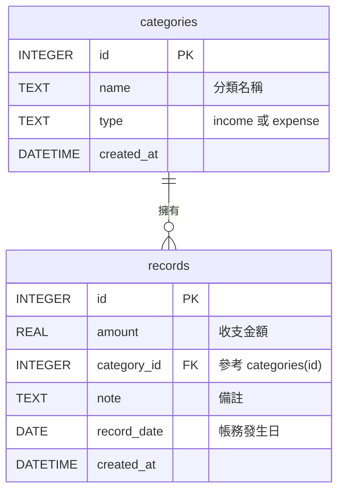

# 資料庫設計文件 (DB_DESIGN)

本文件描述「個人記帳簿系統」所需的實體資料表結構與關聯，作為開發 Model 程式碼的依據。

## 1. ER 圖（實體關係圖）

## 2. 資料表詳細說明

### 2.1 categories (收支分類)
負責儲存系統可用的分類項目，以便將收支進行歸類。
- `id`: INTEGER, Primary Key, 自動遞增。
- `name`: TEXT, 必填。分類名稱 (例如：飲食、薪水)。
- `type`: TEXT, 必填。限定為 `income` (收入) 或 `expense` (支出)。
- `created_at`: DATETIME, 必填。預設為當下時間，標記分類建立時間。

### 2.2 records (收支紀錄)
記載每一筆的實際收入或支出。
- `id`: INTEGER, Primary Key, 自動遞增。
- `amount`: REAL, 必填。收支金額。
- `category_id`: INTEGER, 必填。Foreign Key 對應 `categories` 的 `id`，用於將明細掛載到特定分類下。
- `note`: TEXT, 選填。針對這筆收支的文字說明。
- `record_date`: DATE, 必填。表示該筆收支發生的日期 (YYYY-MM-DD)。
- `created_at`: DATETIME, 必填。系統自動寫入的紀錄產生時間。

## 3. SQL 建表語法
實體 SQL 檔案儲存於 [database/schema.sql](file:///Users/huihsin/web_app_development/web_app_development2/database/schema.sql)。
其中包含了基礎表的建立與 FOREIGN KEY 限制，以及部分預設資料的匯入。
