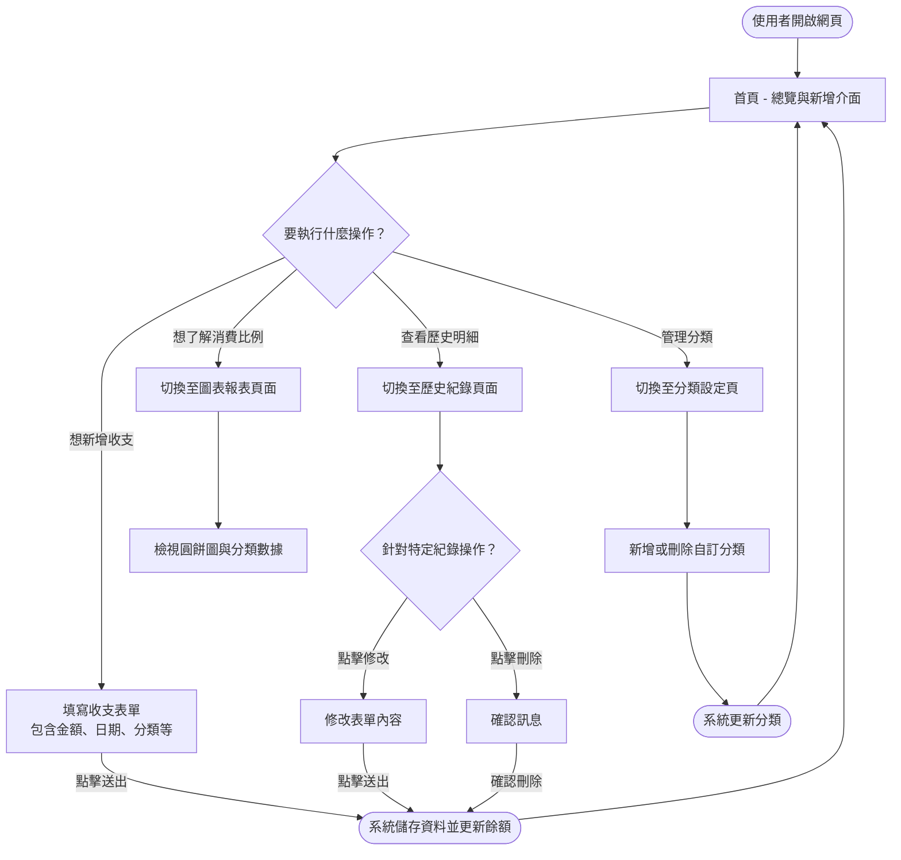
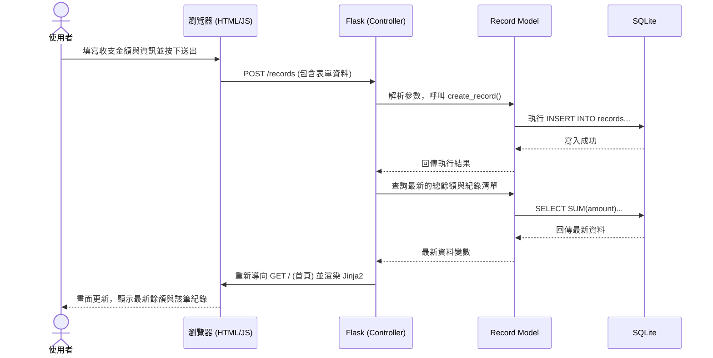

# 流程圖設計文件 (FLOWCHART)

本文件根據「個人記帳簿系統」之 PRD 與相關架構設計，視覺化了使用者的核心操作路徑，以及系統內部的資料與請求流程。

## 1. 使用者流程圖（User Flow）

描述使用者進入記帳系統後，可能進行的各種操作及其先後順序。

## 2. 系統序列圖（Sequence Diagram）

以下描述「使用者點擊新增收支」到「系統將資料存入資料庫」並重新顯示結果的完整生命週期。

## 3. 功能清單與路由對照表

根據 PRD 的需求，我們先規劃好基礎的 URL 路徑與對應的操作。

| 功能描述 | URL 路徑 | HTTP 方法 | 說明 |
| :------- | :------- | :-------- | :--- |
| **首頁總覽** | `/` | `GET` | 顯示總餘額、最近幾筆紀錄，並包含「新增收支」的表單。 |
| **新增收支** | `/records` | `POST` | 接收表單資料並寫入資料庫，完成後回到首頁。 |
| **歷史清單** | `/records` | `GET` | 顯示所有收支列表。 |
| **刪除收支** | `/records/<id>/delete` | `POST` | 依據 ID 刪除該筆紀錄（HTML 表單透過 POST 觸發）。 |
| **修改收支** | `/records/<id>` | `POST` | 接收更新後的紀錄內容寫入資料庫。 |
| **報表頁面** | `/reports` | `GET` | 顯示圖表頁面，由前端圖表模組負責渲染。 |
| **取得圖表資料** | `/api/reports` | `GET` | 回傳統計 JSON 供 JS 繪製圓餅圖 / 長條圖使用。 |
| **新增分類** | `/categories` | `POST` | 新增使用者自訂的收支分類。 |
| **刪除分類** | `/categories/<id>/delete` | `POST` | 刪除單一分類。 |
